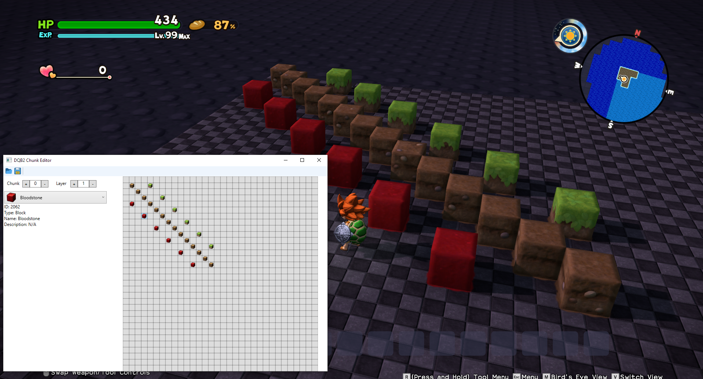

## DQB2 Chunk Editor

Dragon Quest Builders 2 Map Chunk Editor based on the map flattener from https://github.com/turtle-insect/DQB2

Able to edit all chunks and layers. Some issues with unmapped blocks due to duplication. Still need to add color and block shapes as well. I have the ID's, I would like to add functionality around it though.

There are a few bugs here and there, but for the most part it is usuable. There is a lot I want to add and fix, but I am still learning WPF.

"Items" are way more difficult than simple blocks and I am still researching the data structure. Looks like there are a lot of different things that go into those, placement direction, shadows, block tile effects.

Backups are not made when editing, so make sure to keep a backup.

